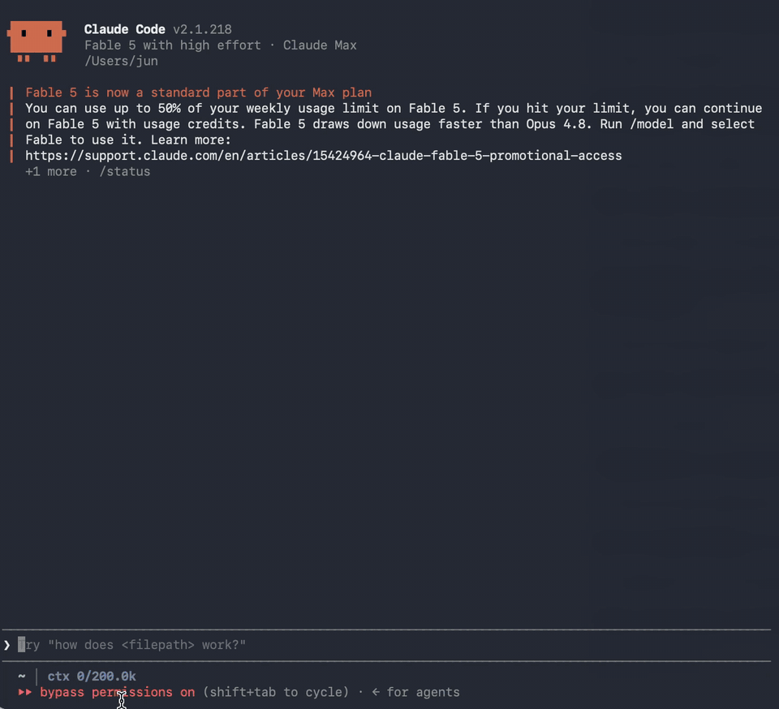

**English** | [简体中文](README.zh-CN.md)

# opencodex — skyhua's hardening fork

Fork of **opencodex 2.63.0** (MIT). Upstream: <https://github.com/lidge-jun/opencodex>.
Mirrors: [GitHub](https://github.com/skyhua0224/opencodex) · [Gitea](https://gitea.sky-hua.xyz:24443/skyhua/opencodex).

This fork carries a hardening patch set written against how the ChatGPT Codex backend actually
behaves: capacity verdicts that arrive *after* a request has been accepted, combo ladders that
used to fail a whole turn on one row's answer, relay quotas that only exist in a web panel, and
WebSocket lanes that degrade quietly per conversation. The full inventory, the measurements behind
each threshold, and how to rebase it onto a newer upstream release live in
**[FORK-NOTES.md](FORK-NOTES.md)**.

## Install

```bash
git clone https://github.com/skyhua0224/opencodex.git
cd opencodex
npm install -g .        # or: bun install -g .
ocx setup               # then: ocx start
```

Self-tests for the new paths (bun):

```bash
bun test/codex-ws-capacity-selftest.ts
bun test/sse-prelude-retry-selftest.ts
bun test/capacity-absorb-selftest.ts
bun test/thread-affinity-selftest.ts
```

## What this fork adds, in one screen

- **Capacity verdicts never reach the client on the official lane.** Four layers, cheapest first:
  an in-socket resend after a declined create, a WebSocket prelude hold, a replayable 503 that lets
  the caller re-dial, and a paced 5s/12s/25s/45s ladder. The SSE lane gets the same treatment: a
  decline that arrives inside an already-200 body is swallowed and a fresh attempt is spliced in
  (`src/lib/sse-prelude-retry.ts`). A decline after content is passed through, because resending
  there would generate a second answer for the same turn.
- **Combo ladders that keep walking.** One row's replay refusal no longer stops the ladder;
  quota-exhausted sites are skipped rather than treated as walls; the official row alone escalates
  onto the 10m → 1h → 3h → 6h → 12h → 24h capacity hold; an exhausted fleet answers
  `503 combo_unavailable` with `Retry-After` instead of a bare 429 the Codex client refuses to
  retry; and degenerate output (repeated segments, a repeated tool signature) parks that row for
  two minutes instead of disabling the channel.
- **Per-conversation transport.** A conversation that keeps collecting overload verdicts steps off
  the WebSocket lane for a while and has its routing identity re-rolled (the client's
  `x-codex-window-id` and the server's `x-codex-turn-state` are dropped for that conversation, and
  the hold survives restarts).
- **Native sessions get the repetition guard too.** The metrics combos have used (repeat ratio,
  longest repeated segment, zlib ratio, identical tool-call signature) now watch directly-routed
  streams as well: a channel that starts repeating is cut with `response.failed`/`degenerate_output`
  instead of being relayed to the end, and the verdict is remembered for that conversation, so a
  combo serving it later demotes the row that looped.
- **Model, tier and safety-buffer attestation.** When the origin reports a different model than the
  one requested, answers on a lower service tier than the one configured, or announces a safety
  buffer that can serve the turn on a faster model, that lands in `~/.opencodex/model-attestation.jsonl`
  and on the log. Nothing is rewritten and nothing errors.
- **`ocx-tiers`**, one command over `usage.jsonl` plus those ledgers: did the tier drop, was a model
  substituted, how many streams were cut for repetition, whether this lane ever sees the edge affinity
  cookies, and how a slow turn splits between our queue, the origin headers, the first content frame and
  the tail (`--links`, `--latency`). `--wsreuse` puts the three WebSocket lanes side by side -- fresh,
  resend inside a turn, cross-turn -- with failures and first-frame medians for each.
- **Latency and link ledgers.** `~/.opencodex/cookie-link.jsonl` records every guarded request's cookie
  shape (names, counts and a hash of the affinity pair -- never a value), and `latency.jsonl` records
  turns at or above 20s with the segment split, so "the proxy feels slow" becomes attributable.
- **A pre-content socket close is replayable.** When the WebSocket lane dies before any frame has been
  relayed, the failure is settled as a resendable status instead of the non-replayable one, so the
  capacity ladder re-dials a fresh socket. The ambiguous marker now only applies once frames are out.
- **The socket pool actually reaches the origin.** Two bugs kept the WebSocket pool from ever seeing a real
  turn: the client's ~4 KiB rotating `x-oai-attestation` exceeded the per-field bound the identity inherited
  from the response-id validator, and per-request headers (attestation, client request id) were part of the
  socket key, so no two attempts could agree on one socket. Long fields are hashed into the key and the
  per-request headers are ignored; a conversation's retries now land on the socket the previous attempt left
  behind. Reusing that socket for the *next* turn is available and **off by default**
  (`OCX_WS_CROSS_TURN_REUSE=1`), because a deadline that cannot distinguish a retired socket from a slow
  origin costs more than it saves on days the origin answers in tens of seconds.
- **Quota the panel knows and the API does not.** Panel-family subscriptions feed the router:
  custom windows, epoch-second reset stamps, and `>= 100%` means exhausted.
- **An intelligence probe with a verifiable answer.** `tools/pelican-probe.py` runs the two questions
  sub2api ships (its prompt text, contract, `high` effort, expected answer and grading rules) against
  any channel through this proxy, grades with a judge on a different channel and writes
  `~/.opencodex/intelligence-probe.jsonl`. First run: the official `gpt-6-sol`/`luna`/`astra` all
  answered 29 to a question whose minimum is provably 21, while `ciii-*` returned `Upstream
  authentication failed` and every `lucen-*`/`portal` returned `SUBSCRIPTION_NOT_FOUND`.
- **Model catalog and management surface** for the `gpt-6` family and the provider fields the
  hardening needs (`retryOnReset`, transient-5xx policy, reasoning efforts, context windows).
- **A wrong answer now costs a channel its turn.** `tools/pelican-probe.py --kind bank --apply` asks
  six questions whose answers were each verified independently (exhaustive searches, `datetime`,
  execution) and grades with a model on a different provider; a clear wrong answer holds that
  provider for 30 minutes and combos demote it, while transport errors, auth failures and unknown
  verdicts change nothing. A full clean round releases the hold. Installed here as a 30-minute
  systemd timer; the first live round held the official lane for answering 29 to a question whose
  minimum is provably 21.
- **Health, fingerprint and restriction watchers.** `ocx-tiers --health` scores each provider from
  its error rate and p90 first-output time; `--fingerprints` lists client-fingerprint drift (a
  Codex update or a header-rewriting relay stops being invisible); and a verdict that is about the
  client rather than the load ("only allows Codex official clients") re-rolls that conversation's
  routing identity immediately instead of waiting for a load threshold.

## License

MIT, unchanged, with upstream's copyright notice — see [LICENSE](LICENSE). Upstream is not
affiliated with this fork; issues about the hardening work belong here, anything about opencodex
itself belongs upstream.

---

## Upstream README

<h3 align="center">make codex open!</h3>
<p align="center"><b>Universal provider proxy for OpenAI Codex, Claude Code, Claude Desktop &amp; Grok Build</b><br>
Two commands, and every one of them runs any LLM you point it at.</p>

<p align="center">
  <a href="https://x.com/claudeebum"></a>
  <a href="https://www.npmjs.com/package/@bitkyc08/opencodex"></a>
  <a href="https://github.com/lidge-jun/opencodex/blob/main/LICENSE"></a>
  
</p>

```bash
npm install -g @bitkyc08/opencodex
ocx start
```

<table>
<tr>
<td width="50%" valign="middle">

### Claude Code, running any model

The picker is stock Claude Code. The brain behind it isn't.

</td>
<td width="50%">
  
</td>
</tr>
<tr>
<td width="50%" valign="middle">

### Codex, running any model

Pick a provider and go — same workflow, different brain.

</td>
<td width="50%">
  
</td>
</tr>
<tr>
<td width="50%" valign="middle">

### Claude Desktop, running any model

Opus answers, then hands the task to a GPT-5.6 Sol subagent.

</td>
<td width="50%">
  
</td>
</tr>
<tr>
<td width="50%" valign="middle">

### Grok Build, running any model

Sol drives the session and calls a Kimi K3 subagent.

</td>
<td width="50%">
  
</td>
</tr>
</table>

<p align="center">
  <a href="README.md">English</a> · <a href="readme/README.fr.md">Français</a> · <a href="readme/README.ko.md">한국어</a> · <a href="readme/README.zh-CN.md">简体中文</a> · <a href="readme/README.zh-TW.md">繁體中文</a> · <a href="readme/README.ru.md">Русский</a> · <a href="readme/README.ja.md">日本語</a> · <a href="readme/README.tr.md">Türkçe</a> · 📖 <a href="https://opencodex.me/"><b>Full documentation →</b></a>
</p>

opencodex is a lightweight local proxy that translates Codex's Responses API into whatever your
provider speaks — streaming, tool calls, reasoning tokens, images, in both directions. Use Claude,
Gemini, Grok, GLM, DeepSeek, Kimi, Qwen, Ollama, or any other LLM with Codex, Claude Code, Claude
Desktop, and Grok Build. It can also manage a **ChatGPT account pool** for Codex auth: add accounts,
refresh their quotas in the dashboard, and let new sessions auto-route to the lowest-usage healthy
account while existing threads stay pinned to the account that started them.

## Quick start

### Personal install

```bash
npm install -g @bitkyc08/opencodex   # Node 18+; the Bun runtime is bundled automatically
ocx start                         # proxy + dashboard on localhost:10100
```

Use `ocx service` to run it in the background.

Open **http://localhost:10100** and configure everything in the web dashboard — add providers
(40+ built-ins, or any OpenAI-compatible endpoint), pick models, manage accounts. `ocx gui`
re-opens the dashboard at any time.

<details>
<summary><b>Desktop app and macOS widget — beta</b></summary>

A native shell around the same dashboard, plus a WidgetKit extension that shows proxy status,
today's usage and provider quotas without opening a browser. The proxy is unchanged: the app
finds a running one or starts the bundled `ocx` sidecar, and the dashboard stays at
**http://localhost:10100**.

It is beta. Builds are signed for integrity but not notarized, so macOS asks for a
right-click → **Open** on first launch and Windows SmartScreen warns on the installer. The
widget needs macOS 14 or newer; the snapshot model it renders lives in [`app/`](./app)
(`MenuBarCore`).

Download it from the [latest release](https://github.com/lidge-jun/opencodex/releases), or build
it locally with `bun run prepare-sidecar && bun run prepare-widget && bunx tauri build`.

Install locations, service files and everything else written to disk are listed in
[`AGENTS_INSTALL.md`](./AGENTS_INSTALL.md#where-things-are-installed). The
[Desktop App guide](https://lidge-jun.github.io/opencodex/guides/desktop-app/) and the
[macOS Menu Bar App guide](https://lidge-jun.github.io/opencodex/guides/macos-menu-bar/) cover
per-platform installation and the Gatekeeper prompt.

</details>

### ChatGPT account pool

opencodex can also manage a **ChatGPT account pool** for Codex auth. Add multiple ChatGPT / Codex accounts,
refresh their 5h / weekly / 30d quota in the dashboard. Under quota routing, new sessions can use
the lowest-usage healthy account; round-robin and fill-first use their own policies. Existing Codex
threads normally retain affinity to the account that started them, so long SSH, tmux, or
mobile-connected sessions do not jump accounts mid-conversation — but quota re-evaluation, failover,
account exclusion, affinity expiry, or 401/403 and 429 recovery can rebind them. Give the accounts a
selection order when one of them — usually your Codex Desktop login — should only be reached for
once the others are drained.

### Sponsors

Sponsors keep opencodex maintained across every upstream protocol change. Interested?
See [SPONSORS.md](./SPONSORS.md).

<!-- sponsors:main — one banner, model developers only; empty until a Main sponsor signs -->

<!-- sponsors:standard — one row per sponsor, in order of signing -->
<table>
<tbody>
<tr>
<td width="180"><a href="https://www.orcarouter.ai/?utm_source=opencodex&utm_medium=readme"></a></td>
<td>Thanks to <a href="https://www.orcarouter.ai/?utm_source=opencodex&utm_medium=readme">OrcaRouter</a> for sponsoring this project! OrcaRouter is one OpenAI-compatible AI gateway for production AI: adaptive routing that grades every prompt and sends it to the model that clears your bar, automatic failover, routing rules as code, zero-markup provider pricing with prompt caching, and guardrails, an agent firewall, and request logs on every call across 200+ models. Pick <code>OrcaRouter</code> in the Add provider picker or run <code>ocx provider add orcarouter</code>; <code>orcarouter/auto</code> is the adaptive router.</td>
</tr>
<tr>
<td width="180"><a href="https://www.packyapi.com/register?aff=k5KT"></a></td>
<td>Thanks to <a href="https://www.packyapi.com/register?aff=k5KT">PackyCode</a> for sponsoring this project! PackyCode is a stable, high-performance API relay provider, offering relay services for Claude Code, Codex, Gemini, and more. With automatic failover, smart routing, and unlimited concurrency, it turns AI into a real productivity tool. <a href="https://www.packyapi.com/register?aff=k5KT">Register via this link</a> and get started! Pick <code>PackyCode</code> in the Add provider picker or run <code>ocx provider add packycode</code>.<br><sub>PackyCode 是一家稳定、高效的 API 中转服务商，提供 Claude Code、Codex、Gemini 等多种中转服务。具备自动故障转移、智能路由和无限并发等多种功能，让 AI 编程成为真正的生产力工具。<a href="https://www.packyapi.com/register?aff=k5KT">点此链接注册</a>，立即开始使用！</sub></td>
</tr>
</tbody>
</table>

---

<details>
<summary>Docker Compose</summary>

The repository ships a digest-pinned, non-root Compose build. The build generates and verifies the
canonical compatibility manifest from the selected Git snapshot. A local clone needs Git and
Docker Compose; a remote Git context needs Docker Compose. Neither path needs host Bun or a
preparation step. Initialize the data-plane token once through stdin and start the hub:

```bash
git clone https://github.com/lidge-jun/opencodex.git
cd opencodex
docker compose build
openssl rand -hex 32 | docker compose run --rm -T hub bun run docker/bootstrap-token.ts
docker compose up -d
curl --fail --silent http://127.0.0.1:10100/healthz
curl --fail --silent http://127.0.0.1:10100/readyz
```

The default host binding is `127.0.0.1:10100`. Remote exposure requires explicit
`OPENCODEX_BIND_ADDRESS=<LAN-or-Tailscale-IP> docker compose up -d`; `0.0.0.0` opts into
all host interfaces. Restrict access with a firewall and an authenticated TLS/tailnet frontend.
The generated JSON stays untracked. The build context admits only `.git/index` and `.git/HEAD` — the
inventory `git ls-files` reads, about 1 MB rather than the full object store — and they are visible
only to the build-only manifest stage through a read-only mount, so no `COPY` includes `.git`. An existing host-generated manifest
is still accepted only after validation; otherwise the build generates one itself. The build rejects
stale manifests, missing or mismatched files, extra source files, and symlinks.
It checks every recorded SHA-256 against the build context and copied runtime files, including
`package.json`, `bun.lock`, and the specifically included `scripts/model-metadata.source.json`.

A remote Git context needs BuildKit to retain Git metadata. This Compose build fragment selects the
remote snapshot and passes the required built-in argument:

```yaml
services:
  hub:
    pull_policy: build
    build:
      context: https://github.com/lidge-jun/opencodex.git#main
      dockerfile: Dockerfile
      target: runtime
      args:
        BUILDKIT_CONTEXT_KEEP_GIT_DIR: "1"
```

The token and mutable state stay in the `ocx-state` named volume; no credential is placed in the
image, Compose file, environment, or shell arguments. See the
[Remote Hub deployment guide](https://opencodex.me/guides/remote-hub/#docker-compose) for provider
setup, authenticated acceptance checks, remote management, and rollback.

</details>

<details>
<summary>Install from source (latest dev)</summary>

**macOS / Linux:**

```bash
curl -fsSL https://bun.sh/install | bash
git clone https://github.com/lidge-jun/opencodex.git
cd opencodex && ~/.bun/bin/bun install
~/.bun/bin/bun run src/cli/index.ts start
```

**Windows (PowerShell):**

```powershell
irm bun.sh/install.ps1 | iex
git clone https://github.com/lidge-jun/opencodex.git
cd opencodex; bun install
bun run src/cli/index.ts start
```

Source install runs the latest `dev` branch. Memory ownership
patches, runtime GC improvements, and unreleased fixes are available here before
they reach the npm package.

</details>

<details>
<summary>For agents</summary>

```bash
npm install -g @bitkyc08/opencodex
ocx start     # or `ocx service`
ocx init      # interactive setup: writes ~/.opencodex/config.json and wires Codex
```

`ocx init` never starts the proxy; start it first (or after — either order works, but headless
commands like `ocx provider add` and `ocx combo set` talk to the **live** proxy and exit nonzero
when it is unreachable). `ocx status` / `ocx doctor` / `ocx health` report the running state.

> **Agents installing or running opencodex:** read
> [`AGENTS_INSTALL.md`](./AGENTS_INSTALL.md). An interactive `ocx start` may ask once whether to
> star this repository — that is the user's decision, never an agent's. The CLI suppresses the
> prompt for agent-driven runs and the API refuses them with `403 agent_consent_required`.

</details>

## Supported platforms

| OS | Status | Service manager |
|---|---|---|
| macOS (arm64 / x64) | Fully supported | launchd |
| Linux (x64 / arm64) | Fully supported | systemd (user unit) |
| Windows (x64) | Fully supported | Task Scheduler (hidden) / opt-in native service (`--native`, WinSW) |

Requires [Node](https://nodejs.org) 18+. The Bun runtime is bundled on `npm install` — no separate
Bun install needed, no WSL needed on Windows. If npm blocked the bundled runtime's install scripts,
see the [installation docs](https://opencodex.me/getting-started/installation/).

## Highlights

- **Use any LLM with Codex, Claude Code, Claude Desktop, and Grok Build** — 40+ providers out of
  the box, each keeping its own native UI.
- **Pool ChatGPT accounts** — thread affinity, quota-aware auto-switching, cooldown and
  fail-closed auth handling.

  > **Provider-policy note:** Account pooling is for routing and operational resilience only; it does
  > not guarantee protection from provider rate limits, enforcement, suspension, or other account
  > actions. OpenCodex does not endorse using additional accounts to circumvent provider limits or
  > sharing account credentials between people. You are responsible for complying with each
  > provider's current terms. See the
  > [Codex Auth account-pool guidance](https://opencodex.me/guides/web-dashboard/#codex-auth-and-account-pools)
  > and [OpenAI's current Terms of Use](https://openai.com/policies/terms-of-use/).
- **Combos** — one virtual model id with failover or weighted round-robin across providers. See
  the [combo guide](https://opencodex.me/guides/combos/).
- **Sub-agents on any model** — feature routed models in Codex's sub-agent picker, with v1/v2
  surface control and fallback chains. See the
  [sub-agent guide](https://opencodex.me/guides/sub-agent-surface/).
<!-- sponsors:main-first-mention -->
- **Log in once, skip the API key** — OAuth for xAI, Anthropic, and Kimi; or forward
  `codex login`, paste a key, or use `${ENV_VAR}` references.
- **Web search & vision sidecars** — non-OpenAI models get real web search and image understanding
  through a sidecar over your ChatGPT login.
- **See what's happening** — the dashboard shows providers, OAuth status, model selection, and a
  live request log with cache token counts.
- **Clean exit, zero residue** — `ocx stop` restores Codex to its original configuration.
- **Bounded memory ownership** — every long-lived cache, ring buffer, and protocol-translation
  store has a finite cap, byte budget, or active reconciliation. No unbounded `Map` or `Set`
  survives a config reload.

<details>
<summary>Memory ownership details</summary>

OpenCodex tracks 36 categories of process-retained state. Each has a documented bound:

- **12 retained stores** (request log, debug rings, image cache, model cache, vision
  descriptions, cursor blobs, responses continuation, etc.) are byte-accounted and
  evicted by the app-owned memory budget (default 256 MiB).
- **4 observed buffers** (translator accumulators, image/OAuth/Grok tails) are
  monitored for in-flight byte pressure without eviction.
- **24 state-store registrations** handle expiry sweeps (60 s interval) and
  config-generation reconciliation so stale provider/account keys are removed.
- **Path and fingerprint memos** (workspace metadata, hardened identities, installation
  salts, mode-hint capabilities) use insertion-order LRU caps (8–128 entries).
- **Model-cache generation tombstones** are deleted after reconciliation; a global
  generation increment prevents stale in-flight discoveries from repopulating removed
  providers.
- **Lab event-id deduplication** runs under a ledger lock from disk, with no
  process-level RAM index.

Run `GET /api/system/memory` (with the admin token) to inspect live retained bytes,
eviction counters, and watchdog samples.

</details>

## Model routing

Target any configured provider and model with the `provider/model` syntax:

```bash
codex -m "anthropic/claude-opus-5" "Explain this stack trace"
codex -m "google/gemini-3-pro" "Write unit tests for auth.ts"
codex -m "ollama/llama3" "Refactor this function"
```

Omit the `provider/` prefix to use the default provider or auto-match by model name pattern.
Provider model ids containing `/` are exposed with inner slashes aliased to `-`; the raw
full-slash form keeps working too. Details: [model routing docs](https://opencodex.me/guides/model-routing/).

## Providers & adapters

<!-- sponsors:main-first-mention -->
OpenAI (ChatGPT login or API key), Anthropic, Google Gemini, xAI, Kimi, Azure OpenAI, Ollama
(local + Cloud), Cursor (experimental), and every OpenAI-compatible endpoint — plus DeepSeek,
Groq, OpenRouter, Together, Fireworks, Cerebras, Mistral, Hugging Face, NVIDIA NIM, MiniMax,
Qwen Cloud, Qoder Global and CN (official PAT + CLI), SiliconFlow, and more. Full list: `ocx init` or the
[provider docs](https://opencodex.me/guides/providers/).

## CLI

```bash
ocx init                       # interactive setup (writes config, wires Codex, offers the shim)
ocx start [--port 10100] [--socks5 [host:port] | --socks5-off]  # SOCKS5 defaults to socks5://127.0.0.1:10808
ocx stop                       # stop + restore native Codex
ocx service [install|repair|restart|start|stop|status|uninstall|remove]  # background service
ocx codex-shim install         # start the proxy on demand whenever `codex` launches
ocx health [--json]            # check immediate proxy liveness
ocx ready [--json] [--wait [--timeout <seconds>]]  # check post-sync readiness
ocx status                     # is the proxy running?
ocx gui                        # open the web dashboard
ocx provider <...>             # manage providers (list/add/edit/test/remove)
ocx account <...>              # manage ChatGPT accounts & API-key pools
ocx combo <...>                # manage failover / round-robin combos
ocx v2 <...>                   # multi-agent v1/v2 surface controls
ocx update [--tag preview]     # update opencodex
```

A start whose preferred port is busy stops and names the holder instead of moving to another port,
so it can never leave a second proxy running beside the first. Free the port, or name a different
one with `--port`. Full reference: [CLI docs](https://opencodex.me/reference/cli/).

### Health and readiness

`GET /healthz` reports immediate proxy liveness. The unauthenticated `GET /readyz` endpoint reports
post-sync readiness with the sanitized JSON identity `{service, version, uptime, pid, port, status}`.
It returns `200` when `status` is `ready`; `pending` and terminal `failed` return `503` with
`Retry-After: 1`.

`ocx ready [--json] [--wait [--timeout <seconds>]]` performs one probe by default. `--wait` polls
for up to 45 seconds by default, but exits immediately when it observes terminal `failed`;
`--timeout <seconds>` sets a 1–300 second limit, requires `--wait`, and accepts only positive integers. CLI `--json` output is
`{ready, status, pid, port}`, where `status` is `ready`, `pending`, `failed`, or `unreachable`.

| Exit | Result |
| --- | --- |
| `0` | Ready |
| `1` | Not ready: pending, failed, timeout, or unreachable |
| `64` | Invalid arguments |

An older proxy without `/readyz` fails closed as `unreachable` with exit 1, while `ocx health`
remains compatible.

### Autostart: service vs shim

Use the **service** (`ocx service`) for an always-on proxy that restarts on crash. Use the
**shim** (`ocx codex-shim install`) for lightweight, on-demand startup without a background
daemon. Remove them with `ocx service uninstall` / `ocx codex-shim uninstall`.

### Uninstall

```bash
ocx uninstall                  # stop, remove service/shim, restore native Codex, clean up state
npm uninstall -g @bitkyc08/opencodex
```

## Remote access

By default opencodex binds to `127.0.0.1` and needs no extra authentication. Binding beyond
loopback (`"hostname": "0.0.0.0"`) **requires** a bearer token — the proxy refuses to start
without `OPENCODEX_API_AUTH_TOKEN`, and every client request must carry it as
`x-opencodex-api-key`. Details: [configuration reference](https://opencodex.me/reference/configuration/).

## Documentation

The public docs — install, providers, routing, combos, sub-agents, sidecars, integrations, and
the CLI/config/management-API references — are built from [`docs-site/`](./docs-site) and
published to **[opencodex.me](https://opencodex.me/)**.

Maintainer source-of-truth notes live under [`structure/`](./structure), contributor setup in
[`CONTRIBUTING.md`](./CONTRIBUTING.md), and security reporting in [`SECURITY.md`](./SECURITY.md).
Report undisclosed vulnerabilities privately through
[GitHub private vulnerability reporting](https://github.com/lidge-jun/opencodex/security/advisories/new),
not a public issue.
That form is the only technical channel — there is no security email. Follow-ups stay in the
private report itself; a public issue may carry coordination only, never vulnerability details.
Acknowledging a report is not the same as triaging it, and no first-response target is promised.

## Development

Source development requires the `bun` CLI on your `PATH`. This is separate from the published npm
package's bundled Bun runtime, which is used only by installed `ocx` commands.

```bash
git clone https://github.com/lidge-jun/opencodex.git
cd opencodex
bun install
bun run typecheck
bun run test
```

See **[Contributing](./CONTRIBUTING.md)**.

Contributor work that landed through a maintainer carry or reimplementation,
where the commit does not name its original author, is recorded in
**[CREDITS.md](./CREDITS.md)**.

## Disclaimer

opencodex is an independent, community-maintained project and is **not affiliated with or endorsed by OpenAI, Anthropic, or any other provider**.

Some providers — notably Anthropic (Claude) — may suspend or restrict accounts that route API traffic through third-party proxies. **Use at your own risk (UAYOR).** Before connecting a provider, review its Terms of Service to confirm that proxy-based access is permitted. The opencodex maintainers are not responsible for any account actions taken by upstream providers.

## License

MIT
